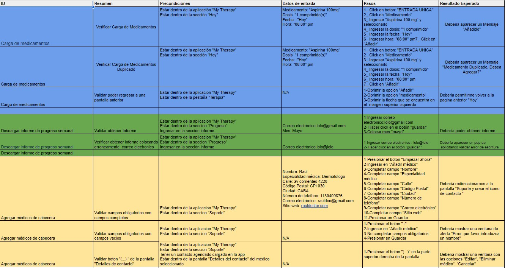
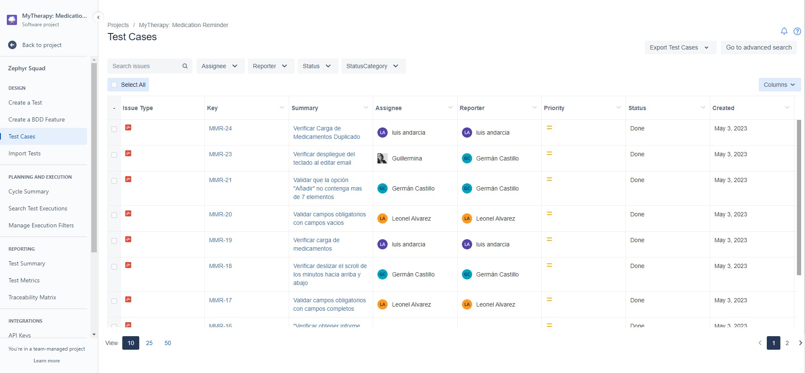
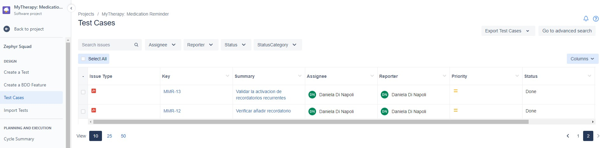
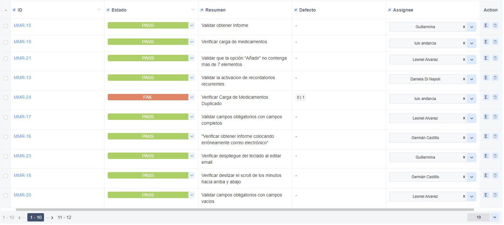
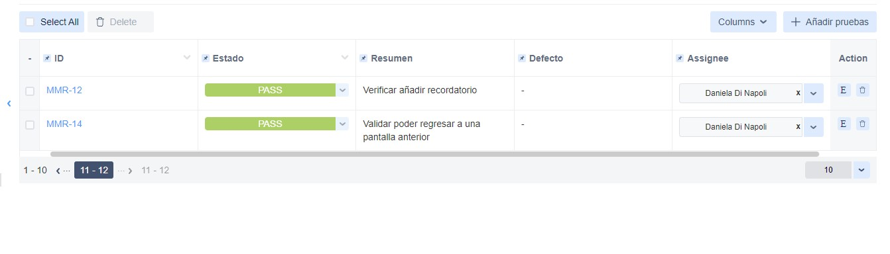

# MyTherapy
 MyTherapy App / testing

Se crearon los Test Cases en la matriz:

Se agregaron los Test Cases de la matriz en JIRA con la herramienta Zephyr:

Primera foto

Segunda foto

Se ejecutaron los TC con la herramiento Zephyr en el Cycle Summary:

Primera foto

Segunda foto

